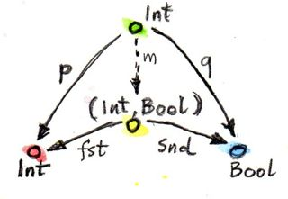
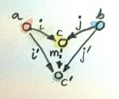
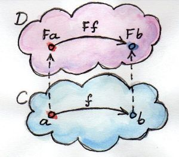
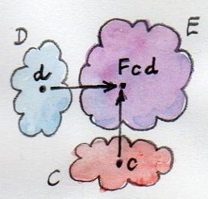
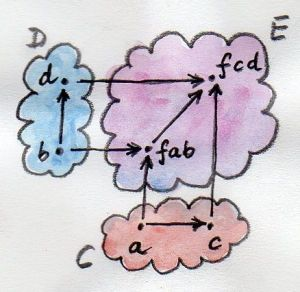
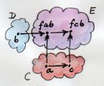
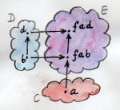

# 范畴论


## 范畴 / Category

一些事物（称为对象/object）及事物之间的关系（称为态射/morphism）构成一个范畴。

> 最小的范畴是拥有0个对象的范畴。因为没有对象，自然也就没有态射。

> 可以通过用态射将对象连接起来的方法构造出范畴。
>
> 给出一个有向图，将它的结点视为对象，将节点间的箭头视为态射。在这个有向图上增加箭头，就可以将之构造成范畴。首先为每个结点添加恒等箭头，然后为所有首位相邻的箭头（即符合复合条件）增加复合箭头。注意每次新增一个箭头，必须考虑它本身与其它箭头（除了恒等箭头）的复合。这种由给定的图产生的范畴，称为**自由范畴**。以上是一种自由构造的示例，即给定一个结构，用符合法则（在此，就是范畴论法则）的最小数量的东西来扩展它。

> 编程语言中，一般是类型体现为对象，函数体现为态射。

## 复合 / Composition

范畴的本质是复合，或者说复合的本质是范畴。若有从对象A到对象B的态射，也有从对象B到对象C的态射，那么必定存在从对象A到对象C的复合态射。

数学中，一般以 $g \circ f$ 表示函数复合（复合顺序从右向左，即 $g \circ f = \lambda x.g \lparen f \lparen x \rparen \rparen$，可读作“g after f”）。下以几种函数式编程语言进行复合思想的演示

```haskell
-- Haskell

-- Haskell中，小写字母表示类型参数，具体类型是大写字母开头
f :: a -> b     -- 接受a返回b的函数
g :: b -> c     -- 接受b返回c的函数
-- 用`.`符进行复合，同数学写法一致，从右向左
g . f           -- f g 复合，其签名 `a -> c`
```

```fsharp
// F#

// F# 中无 `Bottom Type` 的概念。F#中以`'`作为前缀的类型名称视为类型参数
let f : 'a -> 'b = fun x -> failwith "not implement"
// let f<'a, 'b> : 'a -> 'b = failwith "not implement" -- 另一种方式
let g : 'b -> 'c = fun x -> failwith "not implement"

// 用内置操作符`>>` `<<`进行复合，前者从左向右，后者从右向左
f >> g          // 从左向右复合
g << f          // 从右向左复合
```

```scala
// Scala

// Scala 中 `???` 是个 `Nothing` 类型值，`Nothing` 是Scala中的"Bottom Type"

// Scala中的方法/Method 函数/Function 函数值/Function Value 概念存在区别和联系
//   方法强调的是“实例方法”，是在“对象实例”上进行调用的。在trait、class中以`def`关键字定义的有参值是方法（Scala模糊了无参方法和属性的界限，无参方法可以不带括号调用求值）
//   函数无需任何实例即可调用，一般只能进行形如`func(arg)`的调用求值操作。在object、函数中以`def`关键字定义的可视为函数
//   函数值可视为一个函数实例，可以调用其实例方法。以λ给出的值、函数经`func _`转换的值、方法经`obj.method _`转换的值都是函数值，可将该值绑定到`funcVal`上
//      `funcVal.apply(arg)` 传入参数求值（可以直接这样用`funcVal(arg)`，会转换成对`apply`方法的调用）
//      `funcVal.compose(funcVal')` 传入另一个函数值，进行函数复合，其顺序从右向左
//      `funcVal.andThen(funcVal')` 传入另一个函数值，进行函数复合，其顺序从左向右
//      ...
//      注：`andThen` `compose`方法混入自`Function1`特质 (仅`Function1`特质定义了此方法，换言之，仅单参数列表、单参数函数才能进行复合)
//
// Scala中的函数和方法可以是参数多态/泛型的，但函数值必定是确定类型的

// Scala中函数不是自动柯里化/Currying，只能以定义多参数列表函数的形式进行显式柯里化（λ表达式写出柯里化不需任何特殊处理）
//      def func(x: A)(y: B)(z: C): X = ???
//      val func = (x: A) => (y: B) => (z: C) => ???
//      val func: A => B => C => X = x => y => z => ???

val f : A => B = ???
val g : B => C = ???
g compose f     // 从右向左复合，方法作为中缀操作符形式
g.compose(f)    // 从右向左复合，实例方法调用形式
f andThen g     // 从左向右复合，方法作为中缀操作符形式
f.andThen(g)    // 从左向右复合，实例方法调用形式
```

态射的复合需要满足以下两个性质

1. 结合律 / associative

    复合要满足结合律。若有三个态射 $f$ $g$ $h$ 可被复合（即对象可被首尾相连），必有 $h \circ \lparen g \circ f \rparen$ = $\lparen h \circ g \rparen \circ f$ = $h \circ g \circ f$。下面编程语言中以伪代码演示该性质（编程语言未定义“函数相等”）

    ```haskell
    -- Haskell
    f :: A -> B
    g :: B -> C
    h :: C -> D
    h . (g . f) == (h . g) . f == h . g . f
    ```

    ```fsharp
    // F#
    let f : 'a -> 'b = fun x -> failwith "not implement"
    let g : 'b -> 'c = fun x -> failwith "not implement"
    let h : 'c -> 'd = fun x -> failwith "not implement"
    h << (g << f) == (h << g) << f == h << g << f   // 从右向左复合
    f >> (g >> h) == (f >> g) >> h == f >> g >> h   // 从左向右复合
    ```

    ```scala
    // Scala
    val f : A => B = ???
    val g : B => C = ???
    val h : C => D = ???
    h compose g compose f       // 从右向左复合
    f andThen g andThen h       // 从左向右复合
    ```

    对于函数复合的结合律，以上演示应当还是比较显而易见，但是在其它范畴中，可能结合律并不是那么显然。

2. 恒等态射 / identity morphism

    范畴中的任一对象，都存在恒等态射。这个态射从自身出发又返回自身。它是复合的最小单位。恒等态射与任何（符合复合条件的）态射复合，得到的都是后者自身。恒等态射称为$id_A$（意为 identity on A，即A与自身恒等）。

    在数学中，若有接受$A$返回$B$的函数$f$，则有$f \circ id_A = f$ 和 $id_B \circ f = f$

    编程语言中的实现很简单，只需要简单地把输入返回即可（一般函数式编程语言标准库中已有该基本元素）

    ```haskell
    -- Haskell

    id :: a -> a        -- `id` 的函数签名，接受任意类型并返回此类型
    id x = x            -- `id` 的定义   注：Haskell标准库（称为Prelude）已定义
    
    f :: a -> b         -- 它与恒等函数复合之后还是其自身， 注：Haskell中是从右向左复合
    id . f == f         -- 这里的 `id` 是 `id_b`
    f . id == f         -- 这里的 `id` 是 `id_a`
    ```

    ```fsharp
    // F#

    // FSharp.Core 中 `id` 的定义、并以特性方式注明了编译成程序集之后的名称
    [<CompiledName("Identity")>]
    let id x = x    // F#具备自动泛化/Automatic Generalization特性，其类型是 `id : 'a -> 'a`

    let f : 'a -> 'b = fun x -> failwith "not implement"

    id >> f == f    // 从左向右复合，此处 `id` 是 `id_a`
    f >> id == f    // 从左向右复合，此处 `id` 是 `id_b`

    id << f == f    // 从右向左复合，此处 `id` 是 `id_b`
    f << id == f    // 从右向左复合，此处 `id` 是 `id_a`
    ```

    ```scala
    // Scala

    // scala-library 中 `identity` 的定义，标注了 `@inline`
    @inline def identity[A](x: A): A = x

    val f : a => b = ???

    (identity[b] _) compose f == f      // 从右向左复合，此处 `identity` 是 `identity_b`
    f compose identity[a] == f          // 从右向左复合，此处 `identity` 是 `identity_a`

    f andThen identity[b] == f          // 从左向右复合，此处 `identity` 是 `identity_b`
    (identity[a] _) andThen f == f      // 从左向右复合，此处 `identity` 是 `identity_a`
    ```

## 函数 / Function

数学上的函数是值到值的映射。在编程语言中，可以实现数学上的函数：一个函数，给它一个输入值，它就计算出一个结果。每次调用时，对于相同输入，总能得到相同的输出。

编程语言中，给出相同输入保证得到相同输出，且对外界环境无关的函数，称为纯函数。纯函数式语言Haskell中，所有函数都是纯的。对其它语言，可以构造一个纯的子集，谨慎对待副作用。之后将会看到单子如何只借助纯函数对副作用进行建模。

## **Set**

**Set**是集合的范畴。在**Set**中，对象是集合，态射是函数。

存在一个空集 $\emptyset$，它不包含任何元素；也存在只有一个元素的集合。函数可以将一个集合中的元素映射到另一个集合；也能将两个元素映射为一个。但是函数不能将一个元素映射成两个。恒等函数可以将一个元素映射为本身。

## 类型 / Type

范畴中，并非任意两个态射皆可复合。当某态射的源与另一态射的目标是同一对象时，两态射才能复合。在编程语言中，类型关乎复合。在参数及返回类型上，两函数必须满足复合条件，这样在类型意义上程序才是安全的（当然，这一般仅是程序通过编译的保证，并非逻辑正确的保证）。

对于类型，一个直观理解是：类型是值的集合。例如，`Bool`类型是2个元素`True` `False`的集合，`Char`类型是所有Unicode字符的集合。集合可能是有限的（例如`Bool`），也可能是无限的（例如`String`）。当声明`x :: Integer`时，是在说`x`是整型数集中的一个元素。

理想世界中，可以说Haskell的数据类型是集合，Haskell的函数是集合之间的数学函数。但由于“数学函数只知道答案，不可被执行”，Haskell必须要计算才能得出答案。若是可以在有限步骤内计算完毕，这没有什么问题，但有些计算是递归的，可能永远不会终止。在Haskell中无法阻止无终止的计算（停机问题）。Haskell为每个类型添加了一个特殊值，称为底/Bottom，用符号表示为`_|_`或`⊥`。这个值与无休止计算有关。若一个函数声明为`f :: a -> Bool`，它可以返回`True` `False`或`_|_`，后者表示它不会终止。

将**底**作为类型系统的一部分之后，可以将运行时错误作为**底**对待，甚至可以允许函数显式地返回底（一般用于未定义表达式）。例如声明`f :: a -> Bool` 定义`f x = undefined`。因为`undefined`求值结果是**底**，它可以是任何类型的值，因此该定义可以通过类型检查。（甚至`f = undefined`，因为**底**也是`a -> Bool`这种类型的值）。

可以返回**底**的函数称为偏函数；全函数则可以保证对任意参数返回有效的结果。

> 由于**底**的存在，Haskell的类型与函数的范畴称为**Hask**而不是**Set**。从实用的角度看，可以暂时无视掉这些无终止的函数与**底**，将**Hask**视为一个友善的**Set**即可。

> 注：Scala中也有**底**类型的概念存在，`Nothing`是任何类型/`Any`的子类型，`Null`是所有引用类型/`AnyRef`的子类型。F#中没有这一概念。

基于类型是集合的直觉，思考一些特殊情形。

+ 空集

    在Haskell中，空集是`Void`，这是个没有任何值的类型。可以定义一个接受`Void`的函数，但是无法调用它。因为无法提供一个`Void`类型的值（这种值不存在）。该函数的返回值没有任何限制，这是个多态返回类型的函数。Haskell中该函数称为`absurd :: Void -> a`。这种类型与函数，在逻辑学上有更深入的解释。`Void`表示谎言，`absurd`函数的类型相当于“由谎言可以推出任何结论”，这也就是逻辑学中的“爆炸原理”。

    > F# 和 Scala 中似乎没有 空集/`Void` 的概念 ？

+ 单例集合

    这是只有一个值的类型。它实际上是其它编程语言如C++/Java中常见的`void`类型。考虑一个函数`int f42() {return 42;}`。已知无法调用不接受任何值的函数，函数`f42`被调用时发生了什么？从概念上说，接受了一个空值。由于不会有第二个空值，所以没有显式强调它。在Haskell中为空值提供了一个符号`()`（读作"unit"，该符号既是类型也是值）

    > F#中，空值的类型为`unit`，值为`()`；Scala中空值类型为`Unit`，值为`()`，它是`AnyVal`的子类型。

    注意，每个接受unit的函数都等同于从目标类型中选择一个值的函数。实际上，可以将`f42`作为数字`42`的另一种表示方法，这也演示了如何通过与函数交互来代替显式给出集合中某个元素。这证实了数据与计算过程在本质上是没有区别的。从unit到类型A的函数就相当于集合A中的元素。

    考虑让函数返回一个unit的情形。在C++等其它编程语言中，这样的函数通常担当含有副作用的函数，这并非数学意义上的函数。一个返回unit类型的纯函数，它什么也不做；或者说，唯一做的就是丢弃接受的输入。

    ```haskell
    -- Haskell 中的 `unit` 函数
    unit :: a -> ()
    unit _ = ()
    ```

    ```fsharp
    // F# 中的 `ignore` 函数
    // ignore : 'a -> unit
    [<CompiledName("Ignore")>]
    let inline ignore _ = ()
    ```

    Scala中好像没有类似的函数

+ 二元集合

    二元集合一般对应编程语言中的布尔类型。命令式/面向对象编程语言中，该类型一般是内置的`bool`。但在Haskell中可以自行定义 `data Bool = True | False`（读作`Bool`要么是`True`要么是`False`）。（F#中也可以直接进行定义`type Bool = True | False`，Scala中需要借助封闭抽象类/sealed abstract class来定义）

    > 接受`Bool`的纯函数只是从目标类型中选择了两个值，一个关联了`True`，另一个关联了`False`。返回`Bool`的函数被称为“谓词/predicate”。

    > 注： 二元集合并非只有`Bool`，自定义类型也可能是个二元集合（例如`type Gender = Male | Female`）

## Hom-集 / Hom-Set

在一个范畴C中，从对象a到对象b的态射集称为hom-集，记作`C(a,b)`或$Hom_C\lparen a,b \rparen$。

## 序 / Order

存在这样的范畴，其中态射描述两个对象之间的小于等于关系（这是个范畴。每个对象都小于等于自身，因此恒等态射存在；若$a \le b$且$b \le c$，则$a \le c$，态射复合存在；另，态射复合遵守结合律）。伴随这种关系的集合称为前序集/preorder，一个前序集是一个范畴。

可以加强这种对象间的关系，要求该关系满足一个附加条件，即，若$a \le b$且$b \le a$，则必有$a = b$。伴随这种关系的集合称为偏序集/partial order。

若一个集合中的任意两个元素之间存在偏序关系，这种集合称为全序集/total order。

可将这些有序集描绘为范畴。前序集所构成的范畴，在任意两个对象之间最多只有一个态射，这样的范畴称为瘦范畴。瘦范畴内的每个hom-集要么是空集，要么是单例/singleton。在任意前序集构成的范畴内，`C(a,a)`也是个单例hom-集，只包含恒等态射。前序集中是允许出现环的，但偏序集中不允许。

排序需要用到前序、偏序和全序的概念。例如快排、归并之类的排序算法，只能在全序集中进行；偏序集可以用拓扑排序来进行处理。

## 幺半群 / Monoid

幺半群是个简单且重要的概念，它是基本算术幕后的概念：只要有加法或乘法运算就可以形成幺半群。编程中幺半群有很多实例，表现为字符串、列表、可折叠数据结构、并发编程中的`future`、函数式响应编程中的事件等。

数学上，幺半群$\langle S, *, e \rangle$是指一个带有可结合二元运算($*: S \times S \rightarrow S$，这隐含了$S$对运算$*$封闭)和单位元$e$的代数结构$S$。“可结合”是指二元运算满足结合律，$\forall a,b,c \in S \Rightarrow \lparen a * b \rparen * c = a * \lparen b * c \rparen$；单位元是指，$\exists e \in S \And \forall a \in S \Rightarrow a * e = e * a$

**Set**伴随笛卡尔积运算便构成幺半群，其幺元是单例；**Set**伴随“不交并/Disjoint Union”运算也构成幺半群，其幺元是空集。

> 个人理解：**Cat**中，对象是范畴，态射是函子。其构成幺半群所需的二元运算即为“二元函子”。

+ 作为集合

    伴随着一个满足结合律的二元运算和一个特殊“中立”元素的的集合被称为幺半群。对与该二元运算，这个“中立”元素的行为类似一个返回其自身的“unit”。

    例如，加法运算和包含0的自然数集便形成一个幺半群。结合律是指`(a+b)+c=a+(b+c)`或$\lparen a + b \rparen + c = a + \lparen b + c \rparen$。这个理想的、永远保持“中立”的元素是`0`，因为`0+a=a`以及`a+0=a`（$0+a=a$ $a+0=a$）。由于加法满足交换律（`a+b=b+a` $a+b=b+a$），所以似乎再强调`a+0=a`有点多余。但应注意，交换律并非幺半群所需。例如，字符串连接运算不遵守交换律，但字符串及其连接运算可以构成幺半群，它的中立元素是空字符串。

+ 作为范畴

    幺半群可被描述为带有一个态射集的单对象范畴，这些态射皆符合复合规则。

    只含单个对象m的范畴M存在hom-集M(m,m)。在这个集合上可以定义一个二元运算，M(m,m)中两元素“相乘”相当于两态射的复合。复合总是存在的，因为这些态射的源对象与目标对象是同一个对象。这种“乘法运算”也符合范畴论法则中的结合律，因为态射复合满足结合律。恒等态射也是肯定存在的。因此，总是能够从幺半群范畴中复原出幺半群集合。因此，幺半群范畴与幺半群集合是同一个东西。

    > 在范畴论中，是在尝试放弃查看集合及其元素，转而讨论对象和态射。因此，现从范畴的角度来看作用于集合的二元运算。
    >
    > 例如，一个将每个自然数都加5的运算（会将0映射为5、将1映射为6等等）这样就在自然数集上定义了一个函数，现在有了一个函数与一个集合。通常对于任意数字n，都会有一个加n的函数，称之为“adder”。把这些“adder”采用符合直觉的方式去复合，例如`adder5`与`adder7`的复合式`adder12`。因此“adder”的复合等同于加法规则，现在可以用函数的复合来代替加法运算。此外，还有一个面向中立元素0的`adder0`，它不会改变任何东西，因此它是自然数集上的恒等函数。

    > 每个范畴化的幺半群都会定义一个唯一的伴随二元运算的集合的幺半群，事实上总是能够从单个对象的范畴中抽出一个集合，这个集合是态射的集合。

```haskell
-- Haskell

-- 定义 `Monoid` 类型类
class Monoid m where
    empty :: m
    append :: m -> m -> m   -- currying form

-- 将 `String` 声明为一个 `Monoid` ，提供 `empty` `append` 的实现
instance Monoid String where
    empty = ""
    append = (++)      -- 中缀运算符用括号包住后，就转化为接受两个参数的函数
```

```fsharp
// F#

// F# 中不存在 类型类/type class 的概念，参考Scala版本尝试给出了使用接口进行的定义
module Monoid =
    open System         // `String`类存在于`System`名称空间下，或者可以直接用F#为之给出的类型别名：`string`，此处是为了形式一致
    type Monoid<'T> =   // F# 中定义泛型类型时，写法可以是`type 'T Monoid`或`type Monoid<'T>`
        abstract member Zero: 'T
        abstract member BiOp: ('T -> 'T -> 'T)      // 注意，此处给出`BiOp`的类型`('T -> 'T -> 'T)`时带上了括号

    let stringMonoid = {    // 使用对象表达式，直接实例化一个实现了接口的匿名类对象。
        new Monoid<String> with
            member _.Zero = ""
            member _.BiOp = (+)
        }

    type StringMonoid =     // 似乎基于对接口的实现来定义一个新的类并不合适，似乎不太符合"Monoid"的意义
        interface Monoid<String> with    // 也可以写作`String Monoid`
            member _.Zero = ""
            member _.BiOp = (+)

    // ---------------------------

    // F#是一门混合范式语言，一般是函数式编程范式优先。涉及到与面向对象范式混合编程时，存在一些注意事项
    // 在函数式世界里，函数是一等公民，可以作为值来用。
    //      `fun x -> x + 1` 是一个匿名函数值，与数字`1` 字符串`"abc"`的身份没有高低之分
    //      `let add1 = fun x -> x + 1` 是在将“函数值”绑定到名称`add1`上，与`let a = 1`在做的事情没有区别
    //      `let add' = add1` 是在将`add1`的值绑定到名称`add'`上，与`let b = a`行为类似
    // 面向对象的世界里函数/方法并非一等公民，是有特殊处理的
    type I<'T, 'R> =                    // 定义一个泛型接口
        abstract member M1: 'T -> 'R    // 没有括号，这是在定义接受`'T`返回`'R`的函数
        abstract member M2: ('T -> 'R)  // 带上括号，这是在定义`FSharpFunc<'T,'R>`(`'T -> 'R`)类型的只读属性
    type C<'T, 'R>() =                  // 定义一个泛型类型
        let f:'T->'R = failwith "err"   // 私有的函数类型字段
        interface I<'T, 'R> with        // 该类实现泛型接口
            member _.M1 t = f t         // 实现接口中定义的方法，必须显式给出参数。调用时使用`obj.M1(x)`方式
            member _.M2 = f             // 实现接口中定义的属性，只能直接赋函数值。这是`FSharpFunc<'T,'R>`类型的属性，注意与`Func<T,R>`类型不同

    // ---------------------------

    // 使用Monoid实例的时候，似乎可以考虑使用静态解析类型参数来进行约束，而不必要求必须是某个接口的实现 ??
    // 尝试实现失败
    // Constraints: https://docs.microsoft.com/en-us/dotnet/fsharp/language-reference/generics/constraints
    // Statically Resolved Type Parameters: https://docs.microsoft.com/en-us/dotnet/fsharp/language-reference/generics/statically-resolved-type-parameters
    // Type extensions: https://docs.microsoft.com/en-us/dotnet/fsharp/language-reference/type-extensions
    // 静态解析的类型参数: https://docs.microsoft.com/zh-cn/dotnet/fsharp/language-reference/generics/statically-resolved-type-parameters
    // 只有在定义时或内部类型扩展(Intrinsic type extensions)给出的成员才是符合静态类型约束的
    // 类型扩展: https://docs.microsoft.com/zh-cn/dotnet/fsharp/language-reference/type-extensions#optional-type-extensions

    // todo: 等到F#5发布，扩展成员可以作为满足约束的证据
    // 参考ISSUE：[RFC FS-1043] Extension members visible to trait constraints #6805： https://github.com/dotnet/fsharp/pull/6805
    // RFC： https://github.com/fsharp/fslang-design/blob/master/RFCs/FS-1043-extension-members-for-operators-and-srtp-constraints.md

```

```scala
object Monoid {
    trait Monoid[M] {
        def zero : M
        def biOp : (M, M) => M
    }

    val stringMonoid = new Monoid[String] {
        def zero = ""
        def biOp = _ + _
    }

    class StringMonoid extends Monoid[String] {
        def zero = ""
        def biOp = _ + _
    }
}

// -------------------------
trait T[A, B] {         // 定义一个泛型特质，该特质将会被编译成java interface
    val value: A        // 在特质中定义一个A类型的值，将会被编译成接口中一个返回A的无参方法
    def p: A => B       // 在特质中定义一个`A=>B`类型的值，将被编译成一个返回`A=>B`/`Function1[A,B]`的无参方法
    def m(a: A): B      // 在特质中定义一个接受A返回B的方法，将被编译成一个普通的接口方法
}
```

> 注：概念上 `append = (+)` 与 `append s1 s2 = (+) s1 s2` 是不同的。前者是**Hask**范畴（忽略"Bottom Type"的话则是**Set**）中态射的相等，这样不仅写法简洁，也经常被泛化到其它范畴。后者称为外延相等/extensional equality，陈述的是对任意两个输入，`append` 与 `(+)` 的值是相同的。由于参数的值有时也被称为point（函数$f$在点$x$出的值），外延相等也被称为point-wise相等，未指定参数的函数相等称为point-free相等。

## 同构 / Isomorphism

数学上，意味着存在一个从对象a到对象b的映射，同时也存在一个东对象b到对象a的映射，这两个映射是互逆的。在范畴论中，用态射取代映射。一个同构是一个可逆的态射；或者是一对互逆的态射。

可以通过复合与恒等来理解互逆：若态射g与态射f的复合结果是恒等态射，那么g是f的逆。这体现为以下两个方程(因为两个态射存在两种复合形式) `f . g = id` `g . f = id`

## 初始对象 / Initial Object

推广对象的“序”的概念，若存在一个从对象a到对象b的态射，那么认为对象a比对象b更靠前。在范畴中，若存在一个对象，它发出的态射指向所有其它对象，那么这个对象就是**初始对象**。对于给定范畴，可能无法保证初始对象的存在；也可能存在很多个初始对象。考虑有序范畴，在有序范畴中，任意两个对象之间，最多只允许存在一个态射。基于此，给出初始对象定义

初始对象：有且仅有一个态射指向范畴中任意一个对象。

> 以上定义主要是为了让初始对象在同构意义下具备唯一性。(意思是任意两个初始对象都是同构的。)
>
> 假设两个初始对象$i_1$ $i_2$。由于$i_1$是初始对象，因此有唯一的态射f从$i_1$到$i_2$；同理也有唯一的态射从$i_2$到$i_1$。考虑这这两个态射的复合，$g \circ f$必定是$i_1$到$i_1$的态射，由于$i_1$是初始对象，只允许一个$i_1$到$i_1$态射的存在。在范畴中，$i_1$到$i_1$态射是恒等态射，因此$g \circ f$等同于恒等态射。同理，$f \circ g$也是恒等态射。这样就证明了f与g互逆，因此两个初始对象是同构的。

例如，偏序集的初始对象是那个最小的对象。但是，有些偏序集（如整数集）没有初始对象。集合范畴中，初始对象是空集。Haskell中空集对应物是`Void`类型，从`Void`到任意类型的多态函数是唯一的，称为`absurd :: Void -> a`，这是一个态射族，由于该态射存在，`Void`才称为类型范畴中的初始对象。

## 终端对象 / Terminal Object

终端对象：有且仅有一个态射来自范畴中的任意对象。同样，终端对象在同构意义下具备唯一性。

偏序集内，若存在终端对象，那么它是最大的那个对象。集合范畴中，终端对象是个单例，即`()`，有且仅有一个纯函数，从任意类型到unit类型`unit :: a -> ()` （注意，唯一性的条件十分重要。因为有些集合，实际是除了空集的所有集合会有来自其它集合的态射，例如存在函数`yes :: a -> Bool` `yes _ = True`，但是`Bool`并不是终端对象，因为还有 `no :: a -> Bool` `no _ = False`。）

## 对偶 / Duality

对于任意范畴C，反转态射方向、重新定义态射复合方式即可定义一个相反的范畴C'。这个对偶范畴自然能满足所有的范畴性质。原始态射`f :: a -> b` `g :: b -> c`用`h = g . f`复合得到`h :: a -> c`，那么在对偶范畴中 `f' :: b -> a` `g' :: c -> b`用`h' = f' . g'`复合得到`h' :: c -> a`。恒等态射保持不变。

一个范畴中的初始对象，在另一个范畴中就是终端对象。

## 泛构造 / Universal Construction

范畴论中一个常见的构造，称为泛构造，是通过对象之间的关系来定义对象。

给出一个模式(由对象与态射构成的一种特殊的形状)，然后在范畴中观察它的各个方面。如果这个模式很常见且范畴也很大，将会有大量的符合这个模式的东西。然后对这些符合模式的东西进行排序，并选出最好的那个。一般来说，给出排序规则的时候需要一定技巧。

下以积/Product和余积/Coproduct对泛构造的思想进行演示。

## 积 / Product

已知两个集合的笛卡尔积的概念，这个笛卡尔积是个元组/序对的集合。基于此，尝试提取出“积集合”与“成分集合”之间存在的连接模式，这个连接模式便可推广到其它范畴。

积存在两个投影`p`和`q`可将积投影成单个成分。借助此，尝试定义集合范畴中对象和态射的模式，这种模式可以引导构造两个集合`a`与`b`的积。这个模式由对象`c`和两个态射`p::c->a`及`q::c->b`构成。所有的符合这种模式的`c`都可以看作一个候选积，这样的`c`会有很多。

第二步涉及到泛构造的另一方面：排序，或者说对比。需要有这么一个规则，能取对比符合给出模式的两个实例，最终找出最好的那个。现有两个候选，`c`和`p::c->a`及`q::c->b`、`c'`和`p'::c'->a`及`q'::c'->b`，若存在一个态射`m::c'->c`，且由此`m`能重新构造`p'=p.m`和`q'=q.m`，由此可确定`c`比`c'`“更好”。另一个看待这些等式的视角是：`m`看作一个因子，它能将`p'`和`q'`进行“因式分解”。下图给出更直观的复合关系


> 投影`p`和`q`在Haskell/F#中对应物为`fst`和`snd`，其作用是解构二元组。前者取第一个成分、后者取第二个成分。

例如，从类型中选择`Int`和`Bool`，取它们的积。将`Int`和`(Int, Int, Bool)`作为它们的候选积。一个`Int`就可作为`Int`与`Bool`的积，因为它具有`p x = x`和`q _ = True`，这样它就符合了候选积的条件；单个`Bool`同理。三元组`(Int, Int, Bool)`也是一个合理的候选积，因为具备`p (x, _, _) = x`和`q (_, _, b) = b`。能够注意到，第一个候选积太小了，它只覆盖了`Int`方面，第二个候选积又太大了，包含了一个无用的`Int`维。

现在演示`(Int, Bool)`二元组及其映射`fst`和`snd`为何比前面给出的候选积更好。参考下图，对于`Int`，存在一个`m::Int->(Int,Bool)`例`m x = (x,True)`，那么伴随`Int`的`p` `q`可以这样构造`p x = fst (m x) = x`及`q x = snd (m x) = True`；同理，伴随三元组的`m`可以这样实现`m (x,_,b) = (x,b)`。



已经证明了`(Int, Bool)`为何优于另外两者，但仅这样似乎不够完全说服人，因此此处再给出为何反过来就不成立。对于`Int`，是否能找到一个`m'`用于从`p` `q`构造出`fst` `snd`？假如存在，那么就有`fst = p . m'` `snd = q . m'`，已知伴随`Int`的`q`永远是`True`，而`(Int, Bool)`元组中第二成分是`False`的二元组确实存在，因此永远无法从`q`构造出`snd`。而对于`(Int, Int, Bool)`情况就不一样了，总是可以得到足够的信息，但是这里却存在无数个`m'`可以去对`fst` `snd`进行“因式分解”，例如`m' (x, b) = (x, x, b)` `m' (x, b) = (x, 42, b)`等无数个实现。

综上，给出任意类型`c`和两个投影`p`及`q`，有唯一的从`c`到笛卡尔积`(a,b)`的“因子”`m`，可以对`p` `q`进行“因式分解”。事实上，这个`m`只是把`p`和`q`的结果放到了元组 `m::c->(a,b)`、`m x = (p x, q x)`。这使得笛卡尔积`(a,b)`成为了“最好”的符合“积模式”的候选。此外，这也意味着泛构造在集合范畴上运行效果良好，它也指出了任意两个集合的积是什么。

现在，使用相同的泛构造来定义任意范畴中两对象的积。这个积不保证一定存在，但若存在，它就在同构意义下是唯一的，且这个同构是唯一的。

> A **product** of two objects `a` and `b` is the object `c` equipped with two projections such that for any other object `c’` equipped with two projections there is a unique morphism `m` from `c’` to `c` that factorizes those projections.

对象`a`和`b`的积是伴随这两个投影的对象`c`，对任意其它伴随两个投影的对象`c'`，存在唯一的态射`m :: c' -> c`，可以用这个`m`对`c'`的两个投影进行“因式分解”。

因子生成器/factorizer是能生成因子`m`的高阶函数。`factorizer :: (c -> a) -> (c -> b) -> (c -> (a, b))` 其实现 `factorizer p q = \x -> (p x, q x)`

## 余积 / Coproduct

同范畴论中每个构造一样，积的对偶是余积。将积范式中态射的方向反转，便得到了一个对象`c`伴随着两个入射`i :: a -> c`和`j :: b -> c`。对符合余积模式构造的排序方式也反转了，若存在一个态射`m :: c -> c'`，能对伴随`c'`的入射`i' :: a -> c'`及`j' :: b -> c'`进行“类因式分解”，即`i' = m . i`及`j' = m . j`，如下图所示。因此这个“最好”的对象，对任意的其它模式都有一个唯一的态射“发射”出去，这个对象就是余积。只要它存在，那么它在同构意义上就是唯一的，且这个同构也是唯一的。



> A **coproduct** of two objects a and b is the object c equipped with two injections such that for any other object c’ equipped with two injections there is a unique morphism m from c to c’ that factorizes those injections.

对象`a`与`b`的余积是对象`c`伴随着两个入射`i::a->c`及`j::b->c`，对于其它任意的对象`c'`及伴随其的入射`i'::a->c'`及`j'::b->c'`，存在唯一的态射`m::c->c'`，且该态射可以作为“因子”分解`i'`及`j'`

在集合范畴中，余积就是两个集合的不相交求并运算。集合 a 与集合 b 的不相交求并结果中的一个元素，要么是 a 中的元素，要么是 b 中的元素。若两个集合有交集，那么余积会包含公共部分的两份拷贝。可将不相交求并运算结果的一个元素想象为贴着它所属集合的标签的元素。

也可以为余积定义一个因式生成器。对于给定的候选余积 `c` 以及两个候选入射 `i` 与 `j`，为 `Either`生成因式函数的的因式生成器可定义为：

```haskell
factorizer :: (a -> c) -> (b -> c) -> Either a b -> c
factorizer i j (Left a)  = i a
factorizer i j (Right b) = j b
```

## 非对称 / Asymmetry

目前已知两种对偶结构，终端对象可由初始对象经箭头反转后获得，余积可由积经箭头反转而获得。但在集合范畴中，初始对象与终端对象的行为有显著区别，积与余积也有显著区别。积的行为像是乘法运算，终端对象扮演者 1 的角色；余积的行为更像求和运算，初始对象扮演着 0 的角色。特定情况下，对有限集，积的尺寸就是各个集合的尺寸的积；余积的尺寸是各个集合的尺寸之和。

这一切都表明了集合的范畴不会随箭头的反转而出现对称性。

> 注：空集可以向任意集合发出唯一态射（`absurd`函数），但它没有其他集合发来的态射。单例集合拥有任意集合发来的唯一的态射，但它也能向任意集合（除了空集）发出态射。由终端对象发出的态射在拮取其他集合中的元素方面扮演了重要的角色（空集没有元素，因此没什么东西可拮取）

下面理解一下单例`()`作为积和作为余积。

将单例`()`配备两个投影`p`与`q`将之作为候选积。由于积是泛构造，存在态射`m :: () -> (a, b)`，这个态射从积集合中选出一个元素（即一个元组），它也可“因式化”两个投影：`p = fst . m`及`q = snd . m`。这两个投影作用于单例值`()`，上面那两个方程就变为：`p () = fst (m ())`及`q () = snd (m ())`。
由于`m ()`是`m`从积集合中拮取的元素(即一个元组)，`p`所拮取的是参与积运算的第一个集合中的元素，结果是`p ()`，同理`q`拮取的是参与积运算的第二个集合中的元素`q ()`。这完全符合对积的理解，即参与积运算的集合中的元素形成积集合中的序对/元组。

单例作为候选的余积，就不会它作为候选的积那样简单了。确实可以通过投影从单例中抽取元素，但是向单例入射就没有意义了，因为“源”在入射时会丢失。从真正的余积到作为候选余积的单例的态射也不是唯一的。集合的范畴，从初始对象的方向去看，与从终端对象的方向去看，是有显著差异的。

这其实不是集合的性质，而是是我们在 **Set** 中作为态射使用的函数的性质。函数通常是非对称的，下面我来解释一下。

函数是建立在它的定义域（Domain）上的（在编程中，称之为全函数），它不必覆盖余定义域（Codomain、陪域）。目前已经看了一些极端的例子（实际上，所有定义域是空集的函数都是极端的）：定义域是单例的函数，意味着它只在余定义域上选择了一个元素。若定义域的尺度远小于余域的尺度，通常认为这样的函数是将定义域嵌入余定义域中了。例如可以认为，定义域是单例的函数，它将单例嵌入到了余定义域中。将这样的函数称为嵌入函数，但是数学家给从相反的角度进行命名：覆盖了余定义域的函数称为满射（Surjective）函数或映成（Onto）函数。

函数的非对称性也表现为，函数可以将定义域中的许多元素映射为余定义域上的一个元素，也就是说函数坍缩了。一个极端的例子是函数使整个集合坍缩为一个单例，`unit`函数就是这种行为。这种坍缩只能通过函数的复合进行混成。两个坍缩函数的复合，其坍缩能力要强过二者单兵作战。数学家为非坍缩函数取了个名字：内射（Injective）或一对一（One-to-one）映射。

有许多函数即不是嵌入的，也不是坍缩的。它们被称为双射（Bijection）函数，它们是完全对称的，因为它们是可逆的。在集合范畴中，同构就是双射的。

## 代数数据类型 / Algebraic Data Type

### 编程中的积类型

两个类型的积，一般实现为序对(Pair)/元组。

序对并非严格可交换的：不能用`(Int, Bool)`直接替换`(Bool, Int)`，即便两者承载了同样的信息。在同构意义上序对是可交换的，`swap :: (a, b) -> (b, a)` `swap (x, y) = (y, x)`给出了同构关系，可以看作是不同的格式存储了相同的数据。

可通过序对的嵌套完成对任意个类型组合成积，运用“嵌套的序对与元组同构”这一事实可以使构造过程更简单。例如，序对嵌套可以是`(a,(b,c))`或`((a,b),c)`，两者并不相同，但所包含的元素是一一对应的，因此这是一种同构，用不同的方式包装了相同的数据。

可以将积类型的构造解释为作用于类型的一种二元运算。从这个角度来看，上述的同构关系看上去有些像幺半群中的结合律：`(a * b) * c = a * (b * c)`。只不过，在幺半群的情况中，这两种复合为积的方法是等价的，而上述积类型的构造方法只是在“同构条件下”等价。

如果在同构条件下，不再坚持严格相等的话，能揭示`unit`类型`()`类似于数字乘法中的 `1`。类型 `a`的值与一个`unit`值所构成的序对，除了`a`值之外再无其它。因此，这种类型`(a, ())`与`a`是同构的。

用形式化语言描述这些现象，可以说**Set**（集合的范畴）是一个幺半群范畴，亦即这种范畴也是一个幺半群，这意味着可以让两对象相乘（在此，就是两集合去构造笛卡尔积）。

Haskell中有一种更通用的办法来定义积类型 `date Pair a b = P a b` 在此，`Pair a b`是由`a`与`b`参数化的类型的名字；`P`是数据构造子的名字。要定义一个序对类型，只需向`Pair`类型构造子传递两个类型。要构造一个序对类型的值，只需向数据构造子`P`传递两个合适类型的值。类型构造子与数据构造子的命名空间是彼此独立的，二者可以同名：`data Pair a b = Pair a b`。可以发现，Haskell内置的序对类型只是这种声明的一种变体，前者将数据构造子 `Pair` 替换为一个二元运算符 `(,)`。将这个二元运算符像正常的数据构造子那样用，照样能创建序对类型的值。

如果不用泛型序对或元组，也可以定义特定的有名字的积类型，例如`data Stmt = Stmt String Bool`，它是 `String` 与 `Bool` 的积，有自己的名字与构造子。这种风格的类型声明，其优势在于可以为相同的内容定义不同的类型，使之在名称上具备不同的意义与功能，以避免彼此混淆。

F#中，可以`type Pair<'a, 'b> = Pair of 'a * 'b`来定义序对，其本质是定义了一个单例的`union`。

#### 记录 / Record

记录是支持数据成员命名的积类型。

例如用两个字符串表示化学元素的名称与符号，用一个整型数表示原子量，将这些信息组合到一个数据结构中。可以用元组 `(String, String, Int)` 来表示这个数据结构，只不过需要记住每个数据成员的含义。这样的代码很容易出错，并且也难于理解与维护。更好的办法是用记录：`data Element = Element { name :: String, symbol :: String, atomicNumber :: Int }`，上述的元组与记录是同构的。

F#中，记录是这种语法`type Element = {name:string; symbol:string, atomicNumber:int}`

> 感觉也可以这样理解，在面向对象世界里，多个字段构成一个类，就是在构造一个积的过程。
> 
> 类型可以看作集合，可以带上一些业务限制。例如班级信息包含年级、班、学生数量字段，这三者可以都是`Int`，但在业务意义上存在限制(例如1-6年级最多3个班最多60人)，可以看作`(1~6) * (1~3) * (1~60)`的积

### 编程中的和类型

余积在编程中的对应物是和类型。

Haskell官方实现的和类型是`data Either a b = Left a | Right b`。`Either`在同构的意义下是可交换的，也是可嵌套的，而且在同构意义下，嵌套的顺序不重要。因此可以定义出多个类型的和`data OneOfThree a b c = Sinistral a | Medial b | Dextral c`

**Set**对于余积而言也是个（对称的）幺半群范畴。二元运算由不相交和（Disjoint Sum）来承担，`unit`元素便是初始对象。用类型术语来说，可以将`Either`作为幺半群运算符，将`Void`作为中立元素。也就是说，可以认为`Either`类似于运算符`+`，而`Void`类似于`0`。这与事实是相符的，将 `Void` 加到和类型上，不会对和类型有任何影响。例如：`Either a Void`与`a`同构。这是因为无法为这种类型构造`Right`版本的值(不存在类型为`Void`的值)。`Either a Void`只能通过`Left`构造子产生值，这个值只是简单的封装了一个类型为`a`的值。这就类似于`a + 0 = a`。

Haskell中，可以将`Bool`实现为`data Bool = True | False`，就是两个单值的和。`Maybe a = Nothing | Just a`用于表示可能不存在，`Nothing`是个单值表示不存在，因此此定义可以理解成`a+1`，也可重定义成`Maybe a = Either () a`，用`()`表示不存在。`data List a = Nil | Cons a (List a)`，这是一个递归的和类型

F#中似乎没有`Either`的定义，若是用的到，可以自行定义`type Either<'a, 'b> = Left of 'a | Right of 'b`。存在`type Option<'a> = None | Some of 'a`或`type ValueOption<'a> = ValueNone | ValueSome of 'a`。`List`实现类似`type List<'a> = [] | :: ('a * 'a list)`

### 类型代数 / Algebra of Types

当前已有了类型系统中两种幺半群结构：以`Void`作为幺元的和类型、以`()`作为幺元的积类型。

将这两种构造想象为加法和乘法，在这个视角中，`Void`类似于`0`，`()`类似于`1`。这种视角是否符合一些事实，例如：与0相乘的结果依然是0，尝试构造一个`(Int, Void)`序对必定失败，因为不存在一个`Void`值，因此`(Int, Void)`等价于`Void`，即`a * 0 = 0`；数学加法和乘法存在分配律`a * (b + c) = a * b + a * c`，对于积类型与和类型而言，在同构意义上也存在分配律，例如：`(a, Either b c) = Either (a, b) (a, c)`

这种互相纠缠的幺半群称为半环/Semiring(之所以不是全环，是因为无法定义减法)。在此仅关心如何描述自然数运算与类型运算之间的对应关系。下表给出一些对应关系

| Number | Type |
| :-: | :- |
| 0 | `Void` |
| 1 | `()` / `unit` |
| a + b | `Either a b = Left a | Right b` |
| a * b | `(a, b)` / `Pair a b` |
| 2 = 1 + 1 | `Bool = True | False` |
| 1 + a | `Maybe a = Nothing | Just a` / `Option 'a = None | Some of 'a` |

列表类型`List a = Nil | Cons a (List a)`被定义为一个方程的解，因为要定义的类型出现在方程两侧，若将 `List a` 换成`x`，就可以得到这样的方程：`x = 1 + a * x`。

不过，不能使用传统的代数方法去求解这个方程，因为对于类型没有相应的减法与除法运算。不过，可以用一系列的替换，即不断的用 `(1 + a*x)` 来替换方程右侧的 `x`，并使用分配律，这样就有了下面的结果：

```
x = 1 + a*x
x = 1 + a*(1 + a*x) = 1 + a + a*a*x
x = 1 + a + a*a*(1 + a*x) = 1 + a + a*a + a*a*a*x
...
x = 1 + a + a*a + a*a*a + a*a*a*a...
```

最终会是一个积（元组）的无限和，这个结果可被解释为：一个列表，要么是空的，即 `1`；要么是一个单例 `a`；要么是一个序对 `a*a`；要么是一个三元组 `a*a*a`；……以此类推，结果就是一个由 `a` 构成的串。

用符号变量来解方程，这就是代数！因此上面出现的这些数据类型被称为：代数数据类型。

注：类型`a`与类型`b`的积必须包含类型`a`的值与类型`b`的值，这意味着这两种类型都是有值的；两种类型的和则要么包含类型`a`的值，要么包含类型`b`的值，因此只要二者有一个有值即可。逻辑运算`and`与`or`也能形成半环，它们也能映射到类型理论

| Logic | Types |
| :-: | :- |
| false | `Void` |
| true | `()` |
| `a||b` | `Either a b = Left a | Right b` |
| `a&&b` | `(a, b)` |

这是更深刻的类比，也是逻辑与类型理论之间的 Curry-Howard 同构的基础

## 函子 / Functor

函子是范畴之间的映射，给定两个范畴`C`与`D`，函子可以将范畴`C`中的对象映射为`D`中的对象，将`C`中的态射映射为`D`中的态射并“保持结构”。若`C`中有一个对象`a`，它在`D`中的像即为`F a`；`C`中有一个态射`f`从对象`a`出发指向对象`b`，`f`在`D`中的像就是`F f`，它连接了`a`在`D`中的像与`b`在`D`中的像，如下图所示

 

范畴结构中还包含态射复合及恒等态射。若在范畴`C`中有复合`h = g . f`，被函子`F`映射后，有`F h = F g . F f`；范畴`C`中对象`a`的恒等态射$id_a$被映射成范畴`D`中的$id_{F a}$，且$F id_a = id_{F a}$

 

对函子的要求相对严格，因为要求函子保持范畴的结构，它可能会将一些对象“打碎”，也可能会将多个态射“合并”成一个，但它绝不会将任何东西丢弃掉，这种保持结构的约束类似于代数中的连续性条件，也就是说或函子具有“连续性”（函子的连续性还存在更多的限定概念）。

与函数类似，函子可以做折叠或嵌入的工作。所谓嵌入，就是将一个小的源范畴嵌入到更大的目标范畴中。一个极端的例子，源范畴是个单例范畴——只有一个对象与一个态射（恒等态射）的范畴，从单例范畴映射到任何其他范畴的函子，所做的工作就是在后者中选择一个对象。这完全类似于接受单例集合的态射，这个态射会从目标集合中选择元素。最巨大的折叠函子被称为常函子$\Delta_C$ ，它将源范畴中的每个对象映射为目标范畴中特定的对象`c`，也可以将源范畴中的每个态射映射为目标范畴中的特定的恒等态射，在行为上像一个黑洞，将所有东西压成一个奇点。

### 自函子 / Endofunctor

自函子是映射的目标范畴与源范畴相同的函子。

### 类型类 / Type Class

Haskell中使用类型类对函子进行抽象，一个类型类定义了支持一个公共接口的类型族。类型类是Haskell仅有的函数/运算符重载机制。

例如，定义支持相等谓词的类型类如下。该定义陈述的是，如果类型`a`支持`(==)`运算符，那么它就是`Eq`类。`(==)`运算符接受两个类型为`a`的值，返回`Bool`值。使用时声明某个特定类型是`Eq`族的一个“实例”，并提供`(==)`的实现，如下所示

```haskell
-- 定义一个类型类
class Eq a where 
    (==) :: a -> a -> Bool

-- 定义某个类型
data Point = Pt Float Float

-- 声明该类型是Eq类型的实例，并给出相应实现
-- 注：在用到的`Point`的`Eq`功能时声明即可，不必在定义`Point`时声明
instance Eq Point where
    (Pt x y) == (Pt x' y') = x == x' && y == y'
```

函子类型类`Functor`定义如下：

```haskell
class Functor f where
    fmap :: (a -> b) -> f a -> f b
```

这个类型类规定了：若存在符合以上签名的`fmap`方法，那么这个`f`是个函子。小写的`f`是个类型变量，类似于类型变量`a`与`b`，然而编译器能够推断出它是类型构造子而不是类型，依据是它的用途：它可作用于其他类型，即`f a`与`f b`。因此，要声明一个`Functor`的实例时，必须给出一个类型构造子，此处就是`Maybe`：

```haskell
instance Functor Maybe where
    fmap _ Nothing = Nothing
    fmap f (Just x) = Just (f x)
```

> F#不支持类型类，似乎仅能用静态类型解析进行约束，很麻烦很扯淡，此外需要新语言功能release才行（静态扩展允许作为类型解析的证据？）

### 编程中的函子

函子（这里仅关注编程中的自函子）不仅仅只映射对象（编程中对应物为类型），也映射态射（编程中对应物为函数）。

任意被其他类型参数化了的类型，都可视为候选函子。可将函子视为一个抽象的容器

#### `Maybe`函子

以Haskell中的`Maybe`为例，其定义`data Maybe a = Nothing | Just a`就是在将类型`a`映射为`Maybe a`。注意`Maybe`不是一个类型，是个类型构造子，需要提供一个类型参数如`Int`/`Bool`才能使之变成类型`Maybe Int`/`Maybe Bool`。对于任意函数`f :: a -> b`，`Maybe`函子需将之映射成`f' :: Maybe a -> Maybe b`，`f'`的实现为`f' Nothing = Nothing`及`f' (Just x) = Just (f x)`，即函数的参数是`Nothing`，那么返回`Nothing`即可；若这个函数的参数是`Just`，就将`f`应用于`Just`的内容。一般以高阶函数的形式来实现函子的态射映射部分，一般称`fmap`，例如对于`Maybe`函子，其`fmap :: (a -> b) -> (Maybe a -> Maybe b)`。通常说`fmao`“提升”/lift了一个函数，被提升的函数可以作用于`Maybe`层次上的值。由于Currying存在，对于`fmap`的签名`(a -> b) -> Maybe a -> Maybe b`有两个看待视角，一是接受一个`a -> b`类型的函数值，返回一个`Maybe a -> Maybe b`类型的函数值；另一个是接受一个`a -> b`类型的函数值和一个`Maybe a`类型的值，返回一个`Maybe b`类型的值。

为了证明类型构造子 `Maybe` 携同函数 `fmap` 共同形成一个函子，必须证明 `fmap` 能够维持恒等态射以及态射的复合。所证明的东西，叫做“函子定律”。凡是满足函子定律的函子，必定不会破坏范畴的结构。

> F#及Scala中的对应物是`Option`，此外，F#中还有`ValueOption`

#### `List`函子

```haskell
data List a = Nil | Cons a (List a)

instance Functor List where
    fmap _ Nil = Nil
    fmap f (Cons x t) = Cons (f x) (fmap f t)
```

`List`是类型构造子，将任意类型`a`映射为类型`List a`。为了证实`List`是一个函子，必须定义一个“提升”函数`fmap :: (a -> b) -> (List a -> List b)`，它接受一个`a -> b`函数，产生一个`List a -> List b`函数。

#### Reader 函子

Haskell中使用箭头类型构造子`(->)`构造函数类型。形如`a -> b`是对其的中缀使用形式，也可写作前缀形式`(->) a b`。该符合的偏应用/部分应用是合法的，例如`(->) a`是一个接受一个类型参数的类型构造子，它需要一个类型 `b` 来产生完整的类型 `a -> b`，它所表示的是，它定义了一族由`a`参数化的类型构造子。

可以将参数类型称为`r`，将返回类型称为`a`。因此类型构造子可以接受任意类型`a`，并将其映射为类型`r -> a`。为了证实这是个函子，需要一个提升函数`fmap :: (a -> b) -> (r -> a) -> (r -> b)`，它可以将函数`a -> b`“提升”为从`r -> a`到`r -> b`的函数，而`r -> a`与`r -> b`就是`(->) r` 这个类型构造子分别作用于`a`与`b`所产生的函数类型。对于给定的函数`f :: a -> b`与`g :: r -> a`，构造一个函数`r -> b`。复合两个函数是唯一途径，也恰恰就是当前所需。因此，`fmap`的实现为`fmap f g = f . g`，或者直接写作`fmap = (.)`

综上，类型构造子`(->) r`与这个`fmap`组合形成的函子便是Reader函子

```haskell
instance Functor ((->) r) where
    fmap = (.)
```

### 函子作为容器

Haskell模糊了数据与代码的区别。可以将列表视为函数，也可以将函数视为从存储着参数与结果的表中查询数据。如果函数的定义域有界并且不太大，将函数变成表查询是完全可行的。将函子对象（由自函子产生的类型的实例）视为包含着一个值或多个值的容器，即使这些值实际上并未出场；或者说函子对象可能包含产生这些值的方法，不必关心能否访问这些值——这些事发生在函子作用范围之外。如果函子对象包含的值能够被访问，就可以看到相应的操作结果；若不能被访问，那么所关心的只是操作的正确复合，以及伴随不改变任何事物的恒等函数的相关操作。

```haskell
data Const c a = Const c

instance Functor (Const c) where
    fmap _ (Const v) = Const v
```

例如`data Const c a = Const c`，`Const`类型构造子接受两种类型， `c`与`a`，但它忽略参数`a`。类似之前处理箭头构造子那样，对其进行偏应用从而制造了一个函子。数据构造子（也叫`Const`）仅接受`c`类型的值，它不依赖`a`。与这种类型构造子相配的`fmap`类型为：`fmap :: (a -> b) -> Const c a -> Const c b`。因为这个函子是忽略类型参数的，所以`fmap`的实现可以忽略函数参数

### 函子的复合

函子的复合类似于集合之间的函数复合。两个函子的复合，就是两个函子分别对各自的对象进行映射的复合，对于态射也是这样。恒等态射穿过两个函子之后，它还是恒等态射。复合的态射穿过两个函子之后还是复合的态射。函子的复合只涉及这些东西。自函子很容易复合。

以`MaybeTail :: [a] -> Maybe [a]`为例，其实现`MaybeTail [] = Nothing` `MaybeTail [x::xs] = Just xs`，返回的结果是两个作用于`a`的函子`Maybe`与`[]`复合后的类型。这两个函子每个都有自己的`fmap`，若想将函数`f`作用于被`Maybe []`包含的内容，需要突破两层函子的封装。例如若要对`mis :: Maybe [Int]`中包含的数字`mis = Just [1, 2, 3]`用`square x = x * x`求平方，可以这样做：`mis2 = fmap (fmap square) mis`。经类型分析过后，对于内部的`fmap`使用`List`版本，外部的`fmap`使用`Maybe`版本。它可重写为`mis2 = (fmap . fmap) square mis`，重写版本是`fmap :: (a -> b) -> (f a -> f b)`视角，`(fmap . fmap)`中第二个`fmap`接受`square :: Int -> Int`返回`[Int] -> [Int]`，第一个`fmap`接受这个函数并返回`Maybe [Int] -> Maybe [Int]`，最终作用于`mis`并求得结果。两个函子的复合结果依然是函子，并且这个函子的 `fmap`是那两个函子对应的`fmap`的复合

函子的复合是遵守结合律的，因为对象的映射遵守结合律，态射的映射也遵守结合律。在每个范畴中也有一个恒等函子：它将每个对象都映射为其自身，将每个态射映射为其自身。因此在某个范畴中，函子具有与态射相同的性质。什么范畴会是这个样子？必须得有一个范畴，它包含的对象是范畴，它包含的态射是函子，也就是范畴的范畴。但是，所有范畴的范畴还必须包含它自身，这样我们就陷入了自相矛盾的境地，就像不可能存在集合的集合那样。但是，存在一个叫做 **Cat** 的范畴，它包含了所有的“小范畴”。这个范畴是一个“大的范畴”，因此它就不可能是它自身的成员。所谓的“小范畴”，就是它包含的对象可以形成一个集合，而不是某种比集合还大的东西。注意，在范畴论中，即使一个无限的不可数的集合也被认为是『小』的。以后也会看到函子也能形成范畴。

## 二元函子 / Bifunctor

函子是**Cat**范畴（范畴的范畴）中的态射，因此对于态射形成的直觉（编程中的函数）大部分可适用于函子。直觉上能理解一个函数接受两个参数，函子也可。接受两个参数的函子称为**二元函子**。对于对象而言，若一个对象来自范畴$C$，另一个对象来自范畴$D$，那么二元函子可以将这两个对象映射为范畴$E$中的某个对象。也就是说，二元函子是将范畴$C$与范畴$D$的**笛卡尔积** $C \times D$映射为$E$，如下图所示。函子性也意味着二元函子也可以映射态射，也就是二元函子必须将一对态射（即范畴$C \times D$中的一个态射，其中一个来自$C$，一个来自$D$）映射为$E$中的一个态射。

> 注，若一个态射是在范畴的笛卡尔积中定义的，那么它的行为就是将一对对象映射为另一对对象。这样的态射可以复合`(f, g) ∘ (f', g') = (f ∘ f', g ∘ g')`，这样的复合是符合结合律的。此外，也有恒等态射`(id, id)`。范畴的笛卡尔积也是一个范畴。



将二元函子想象为具有两个参数的函数会更直观一些。要证明二元函子是否是函子，不必借助函子定律，只需独立的考察它的参数即可。如果有一个映射，它将两个范畴映射为第三个范畴，只需证明这个映射相对于每个参数（例如，让另一个参数变成常量）具有函子性，那么这个映射就自然是一个二元函子。对于态射，也可以这样来证明二元函子具有函子性。

> 个人理解：“二元函子”作为使“范畴的范畴”构成一个幺半群所需的二元运算。这需要联系幺半群定义去理解。

```haskell
class Bifunctor f where
    bimap :: (a -> c) -> (b -> d) -> f a b -> f c d
    bimap g h = first g . second h      -- or: second h . first g
    first :: (a -> c) -> f a x -> f c x
    first g = bimap g id
    second :: (b -> d) -> f x b -> f x d
    second = bimap id
```

以上是用Haskell定义了一个二元函子，本例中，三个范畴都是Haskell类型范畴。一个二元函子是个类型构造子，它接受两个类型参数，类型变量`f`表示二元函子，关于它的所有应用都是在接受两个类型参数。二元函子伴随着一个“提升”函数`bimap`，它将两个函数映射为`(f a b -> f c d)`函数。`bimap`有一个默认的实现，即`first`与`second`的复合，这表明只要`bimap`分别对两个参数都具备函子性，就意味着它是一个二元函子(如下图)。

 

其他两个类型签名是`first`与`second`，他们分别作用于`bimap`的第一个与第二个参数，因此它们是`f`具有函子性的两个`fmap`证据(如下图)。上述类型类的定义以`bimap`的形式提供了`first`与`second`的默认实现。

 

当声明`Bifunctor`的一个实例时，可以去实现`bimap`，这样`first`与`second`就不用再实现了；也可以去实现`first`与 `second`，这样就不用再实现`bimap`。当然也可以三个都实现了，但是需要确定它们之间要满足类型类的定义中的那些关系。

### 积于余积二元函子 / Product and Coproduct Bifunctors

由泛构造定义的两个对象的积，即范畴积，是二元函子的一个重要例子。若任意两个对象之间存在积，那么从这些对象到积的映射便具备二元函子性。这通常是正确的，尤其是在Haskell中。

```haskell
instance Bifunctor (,) where
    bimap f g (x, y) = (f x, g y)
```

序对构造子作为最简单的积类型，就是一个`Bifunctor`的实例。`bimap :: (a -> c) -> (b -> d) -> (a, b) -> (c, d)`作用是很清晰的。这个二元函子的用途就是产生的类型序对`(,) a b = (a, b)`

```haskell
instance Bifunctor Either where
    bimap f _ (Left x) = Left (f x)
    bimap _ g (Right y) = Right (g y)
```

余积作为对偶，若它是作用于范畴内的每一对对象，那么它也是二元函子。以上给出了Haskell中余积二元函子`Either`的例子。

### 具备函子性的代数数据类型 / Functorial Algebraic Data Types

代数数据类型/ADT具备函子性。

目前所见的几个参数化数据类型的例子都是函子（可以为之定义`fmap`）。复杂的数据类型是由简单数据类型构造出来的，尤其是ADT，它是由和与积构造而来。目前以已确定积与和具备函子性及函子的复合，因此只需证实ADT的基本构造块具备函子性，那么就可以确定ADT基本函子性。

首先，有些构造块是不依赖于函子所接受的类型参数的，例如`Maybe`中的`Nothing`或者`List`中的`Nil`。它们等价与`Const`函子（`Const`函子忽略它的类型参数---实际上是忽略第二个类型参数，第一个被保留作为常量）。其次，有些构造块简单的将类型参数封装为自身的一部分，例如`Maybe`中的`Just`，它们等价于恒等函子。恒等函子是**Cat**范畴中的恒等态射，Haskell未对它进行定义，这里给出：

```haskell
data Identity a = Identity a
instance Functor Identity where
    fmap f (Identity x) = Identity (f x)
```

可将`Identity`视为最简单的容器，它只存储类型`a`的一个（不变）的值。其他的代数数据结构都是使用这两种基本类型的和与积构建而成。

基于此来看待`Maybe`，`data Maybe = Nothing | Just a`。这是两种类型的和，求和是具备函子性的。第一部分`Nothing`可以表示为作用于类型`a`的`Const ()`（`Const`的第一个类型参数是`unit`），而第二部分不过是恒等函子的化名而已。在同构的意义下可以将`Maybe`定义为：`type Maybe a = Either (Const () a) (Identity a)`。`Maybe`是`Const ()`函子与`Identity`函子被二元函子`Either`复合后的结果。(`Const`本身也是一个二元函子，只不过在这里用的是它的偏应用形式)

两个函子的复合后，其结果是一个函子。此外，还需要确定两个函子被一个二元函子复合后如何作用于态射。对于给定的两个态射，可以分别用这两个函子对其进行提升，然后再用二元函子去提升这两个被提升后的态射所构成的序对。

可以在Haskell中定义这种复合 `newtype BiComp bf fu gu a b = BiComp (bf (fu a) (gu b))`，定义二元函子`bf`、两个函子`fu`与`gu`、两个常规类型`a`与`b`，将`a`应用到`fu`，`b`应用到`gu`，然后将`fu a`与`gu b`应用到`bf`。这是对象的复合，在Haskell中也是类型的复合。将`Either`、`Const ()`、`Identity`，`a`和`b`应用到`BiComp`得到的`BiComp (Either (Const () a) (Identity b))`，这就是一个裸奔版本的`Maybe`。

`bf`是二元函子、`fu`与`gu`是函子，那么这个新的数据类型`BiComp`就是`a`与`b`的二元函子。编译器必须知道与 `bf` 匹配的 `bimap` 的定义，以及分别与 `fu` 与 `gu` 匹配的 `fmap` 的定义。在 Haskell 中，这个条件可以预先给出：一个类约束集合后面尾随一个粗箭头：

```haskell
instance (Bifunctor bf, Functor fu, Functor gu) =>
  Bifunctor (BiComp bf fu gu) where
    bimap f1 f2 (BiComp x) = BiComp ((bimap (fmap f1) (fmap f2)) x)
```

伴随`BiComp`的`bimap`实现是以伴随`bf`的`bimap`以及两个分别伴随`fu`和`gu`的`fmap`给出的。在使用`bimap`时，编译器会自动推断出所有类型，并选择正确的重载函数。`bimap`的定义中，`x` 的类型为`bf (fu a) (gu b)`，有点复杂。外围的`bimap`脱去它的`bf`层，然后两个`fmap`分别脱去它的`fu`与`gu`层。若`f1 :: a -> a'`及`f2 :: b -> b'`，那么，最终结果是类型 `bf (fu a') (gu b')`，因此`bimap`签名可以理解为`bimap :: (fu a -> fu a') -> (gu b -> gu b') -> bf (fu a) (gu b) -> bf (fu a') (gu b')`，这其实与`bimap :: (a -> c) -> (b -> d) -> f a c -> f b d`并无区别。

## Kleisli范畴 / Kleisli Category

[Kleisli Categories](https://bartoszmilewski.com/2014/12/23/kleisli-categories/)

[<译> Kleisli 范畴](https://segmentfault.com/a/1190000003898795)

Kleisli 范畴给出了在范畴论中对副作用或非纯函数的进行构造或建模的方法。

从编程语言的视角，可以看作是将类型（目前所见都是返回类型）进行包装（包装的主要目的是加入一些附加信息），然后对包装后的类型的处理。态射就是从任意类型`a`到包装类型`M b`的函数`a -> M b`；态射复合 `(>=>) :: (a -> M b) -> (b -> M c) -> (a -> M c)` 该运算符称为"fish"；该范畴的恒等态射为 `return :: a -> M a`，举例如下：

```haskell
-- Writer in Haskell

type Writer a = (a, String)     -- 仅是在定义一个类型别名

-- 该范畴中的态射是从任意类型到Writer类型的函数 `a -> Writer b`
-- 复合的签名如下所示
(>=>) :: (a -> Writer b) -> (b -> Writer c) -> (a -> Writer c)
-- 复合操作符的实现
m1 >=> m2 = \x ->
    let (y, s1) = m1 x
        (z, s2) = m2 y
    in  (z, s1 ++ s2)

-- 该范畴中的恒等态射
return :: a -> Writer a
return x = (x, "")

-- ----------------------
-- 对以上进行应用
-- 定义两个操作
upCase :: String -> Writer String       -- 将字符转换成大写，并带上附加信息
upCase = (map toUpper s, "upCase")
toWords :: String -> Writer [String]    -- 将字符串切成多个单词，并带上附加信息
toWords = (words s, "toWords")

toUpThenToWords :: String -> Writer [String]    -- 将以上两个操作复合起来
toUpThenToWords = upCase >=> toWords
```


```fsharp
// Writer in F#

type Writer<'a> = 'a * string   // 仅定义了类型别名

let (>=>) m1 m2 = fun x ->      // 这里推断为`m1:('a -> 'b * int) -> m2:('b -> 'c * int) -> x:'a -> 'c * int`
    let (y, s1) = m1 x
    let (z, s2) = m2 y
    (z, s1 + s2)

let toUpper str = Writer (str.ToUpper(), "toUpper") // 实际上没必要带上`Writer`
let toWords str = Writer (str.ToWords(), "toWords")

let proc = toUpper >=> toWords

// 可以将`Writer`生命为单实例的联合
type Writer<'a> = Writer of 'a * string
let (>=>) m1 m2 = fun x ->
    let (Writer (y, s1)) = m1 x
    let (Writer (z, s2)) = m2 y
    Writer (z, s1 + s2)
```


### `Writer`范畴


```cpp
// de 
```


<!-- todo 数学定义没看懂，直观定义尚未总结，先给出 -->

将之理解成对副作用进行包装？

Haskell中的 Writer 范畴 ??


