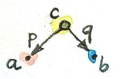
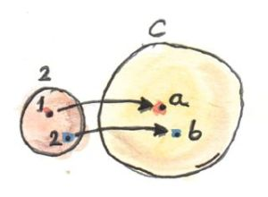

# Limits and Colimits

[Limits and Colimits](https://bartoszmilewski.com/2015/04/15/limits-and-colimits/)

[Category Theory II 1.2: Limits](https://www.youtube.com/watch?v=sx8FELiIPg8&list=PLbgaMIhjbmElia1eCEZNvsVscFef9m0dm&index=2)
[Category Theory II 2.1: Limits, Higher order functors](https://www.youtube.com/watch?v=9Qt664lfDRE&list=PLbgaMIhjbmElia1eCEZNvsVscFef9m0dm&index=3)
[Category Theory II 2.2: Limits, Naturality](https://www.youtube.com/watch?v=1AOHbF6Ex8E&list=PLbgaMIhjbmElia1eCEZNvsVscFef9m0dm&index=4)
[Category Theory II 3.1: Examples of Limits and Colimits](https://www.youtube.com/watch?v=TtvVHokhSoM&list=PLbgaMIhjbmElia1eCEZNvsVscFef9m0dm&index=5)

---

极限和余极限

---

在范畴论中，所有事物之间都是有联系的，我们可以从任意角度对它们进行考察。例如对积的泛构造，现在我们已经了解了函子和自然变换，那么这个泛构造是否可以简化甚至泛化？下面尝试一下

积的构造始于对两个对象`a`和`b`的选择，我们想要构造这二者的积。首先，“选择对象”到底意味着什么？我们能否用范畴论中的术语来描述这一动作？两个对象形成了一个非常简单的模式，我们可以将这个模式抽象到一个非常简单的范畴。我们将这个范畴称为**2**，它只包含了`1`和`2`两个对象，除了两个必须存在的恒等态射，也没有其他态射了。现在可以将“从范畴`C`中选择两个对象”的行为表述为“定义一个从范畴**2**到范畴`C`的函子`D`”。一个函子将对象映射到对象，因此它的象只是两个对象（也可能是一个，若该函子映射对象时有坍缩行为的话）；函子也映射态射，在当前情况下只是将恒等态射映射成恒等态射。

What’s great about this approach is that it builds on categorical notions, eschewing the imprecise descriptions like “selecting objects,” taken straight from the hunter-gatherer lexicon of our ancestors. And, incidentally, it is also easily generalized, because nothing can stop us from using categories more complex than **2** to define our patterns.