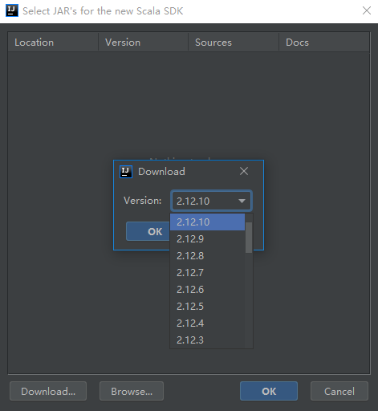
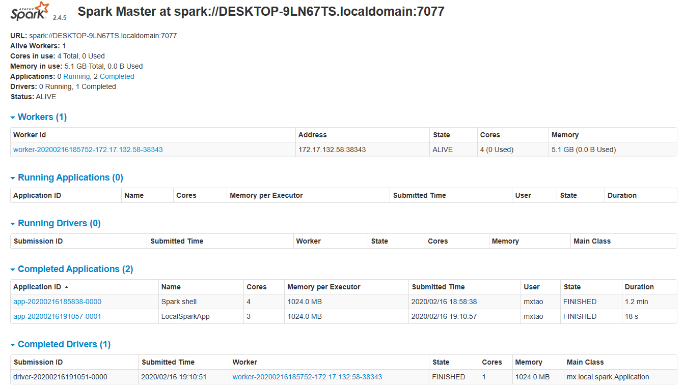

# 准备开发环境

---

+ [x] Windows
  + [x] JDK
  + [x] Scala SDK
  + [x] Spark
  + [x] IDEA
+ [x] WSL / Linux
  + [x] VSCode Remote

在Windows系统配置开发及测试环境

## Windows

### JDK

1. 安装

    需要下载安装两个版本的JDK：

    + JDK 1.7：用于适配公司平台打包程序使用，互联网环境做测试可以先不装。现在很难下到了，内网的话，咱们自己有。
    + [JDK 1.8](https://www.oracle.com/java/technologies/javase/javase-jdk8-downloads.html)：本地运行Spark Shell使用，Oracle现在贼了不少，需要Oracle账户才能下载，百度上有很多分享，搜一个就行

    > 对于我们目前的开发和测试，请使用JDK1.8，先不要使用JDK11(虽然它是LTS)。（测试过JDK11+Scala，有的行为不一致，可能是Scala对高版本JDK的优化？？？）

2. 配置`JAVA_HOME`环境变量

    将JDK 1.8配置到`JAVA_HOME`作为全局使用

    > 注意：Spark运行的时候是查找`JAVA_HOME`环境变量然后运行，不是从`PATH`中的`java.exe`启动

    > 注意：如果将JDK安装在默认位置，如`C:\Program Files\Java\jdk1.8.0_241\`，由于路径中的空格问题，将会导致Windows上的Spark Shell启动失败，将`JAVA_HOME`环境变量修改成：`C:\PROGRA~1\Java\jdk1.8.0_241\`这种形式

3. 配置`PATH`环境变量

    这个步骤不是必须，但是建议做，环境变量配置完毕后，可以用`java -version`命令来验证安装

    ```text
    PS C:\Users\mxtao> java -version
    java version "1.8.0_241"
    Java(TM) SE Runtime Environment (build 1.8.0_241-b07)
    Java HotSpot(TM) 64-Bit Server VM (build 25.241-b07, mixed mode)
    PS C:\Users\mxtao>
    ```

### Scala SDK

需要下载安装两个版本的Scala SDK：
   + [Scala 2.10.7](https://downloads.lightbend.com/scala/2.10.7/scala-2.10.7.zip): 用于适配公司平台打包程序使用
   + [Scala 2.11.12](https://downloads.lightbend.com/scala/2.11.12/scala-2.11.12.zip)：面向测试环境开发程序使用

将两个Scala SDK的zip下载并解压到某处即可，如`C:\Program Files\Scala\`，不需要配置环境变量。安装完毕之后，可以进入安装目录尝试启动一下Scala REPL，可以在这个环境尝试一下Scala语言。

```text
PS C:\Program Files\Scala\scala-2.11.12\bin> .\scala
Welcome to Scala 2.11.12 (Java HotSpot(TM) 64-Bit Server VM, Java 1.8.0_241).
Type in expressions for evaluation. Or try :help.

scala> :quit
PS C:\Program Files\Scala\scala-2.11.12\bin>
```

如果是互联网环境开发，Scala SDK的手动安装可以跳过，使用IDEA来下载Scala SDK，如下图所示。



### Spark

1. 下载安装Spark

    建议从[Downloads | Apache Spark](https://spark.apache.org/downloads.html)找到最新稳定版进行下载，建议选择“Pre-build for Apache Hadoop”版本进行下载，这样避免配置Hadoop环境的麻烦。此处附上国内清华镜像的[Spark 2.4.5 & Hadoop 2.7](http://mirrors.tuna.tsinghua.edu.cn/apache/spark/spark-2.4.5/spark-2.4.5-bin-hadoop2.7.tgz)。将这个压缩包解压到某处即可，如`C:\Software\Spark\`

    > Spark目录下的`examples`是一些样例代码，包含Spark Core、Spark SQL及其它组件的使用样例，可以直接参考使用

2. 配置WinUtils

    若要使Hadoop在Windows上正常运行，需要做些别的事情。从此处[cdarlint/winutils](https://github.com/cdarlint/winutils)找到对应或者更高版本的winutils下载下来。此处附上该项目的[完整ZIP](https://github.com/cdarlint/winutils/archive/master.zip)。

    我们前面下载的Spark附带的是Hadoop 2.7，因此我们选择了适配2.7.7版本的winutils，将所有文件放在`C:\Software\Hadoop\bin`中，此时winutils.exe完整路径为`C:\Software\Hadoop\bin\winutils.exe`

    现在开始配置环境变量，新增名为`HADOOP_HOME`的环境变量，其值为`C:\Software\Hadoop`，然后在`PATH`环境变量中添加`%HADOOP_HOME%\bin\`

    > 必须配置`HADOOP_HOME`环境变量

3. 启动Spark Shell

    进入上文Spark的安装目录，尝试启动Spark Shell检查安装情况。按<kbd>Ctrl</kbd>+<kbd>D</kbd>可退出Spark Shell

    ```text
    PS C:\Software\Spark\spark-2.4.5-bin-hadoop2.7\bin> ./spark-shell
    Using Spark's default log4j profile: org/apache/spark/log4j-defaults.properties
    Setting default log level to "WARN".
    To adjust logging level use sc.setLogLevel(newLevel). For SparkR, use setLogLevel(newLevel).
    Spark context Web UI available at http://DESKTOP-9LN67TS.mshome.net:4040
    Spark context available as 'sc' (master = local[*], app id = local-1581394859054).
    Spark session available as 'spark'.
    Welcome to
        ____              __
        / __/__  ___ _____/ /__
        _\ \/ _ \/ _ `/ __/  '_/
    /___/ .__/\_,_/_/ /_/\_\   version 2.4.5
        /_/

    Using Scala version 2.11.12 (Java HotSpot(TM) 64-Bit Server VM, Java 1.8.0_241)
    Type in expressions to have them evaluated.
    Type :help for more information.

    scala>
    ```

    观察输出的内容，Spark Shell的Application UI开放在本地4040端口，可以访问看看，如下图所示。由于尚未运行任务，所以暂时没太多实质内容

    

### IDEA

安装[IDEA](https://www.jetbrains.com/idea/download/)，安装[Scala插件](https://plugins.jetbrains.com/plugin/1347-scala/versions)。这里主要解释如何创建一个方便本地测试的项目。

创建一个Scala项目，JDK版本选择1.8，Scala SDK版本选择2.11.12。创建完毕后，将Spark安装目录下的jars(即`C:\Software\Spark\spark-2.4.5-bin-hadoop2.7\jars`)设为项目依赖包。到目前为止，项目配置已完毕，可以直接在本地环境调试Spark项目。下面附上一段代码作为本地项目起点

```scala
import org.apache.spark.sql.SparkSession

object Application {

  def main(args: Array[String]): Unit = {
    val spark = SparkSession.builder().appName("LocalSparkApp").master("local[*]").getOrCreate()
    val sc = spark.sparkContext
    import spark.implicits._

    // val schema = "a INT, b STRING, c DOUBLE"
    // val df = spark.read.schema(schema).option("sep", "\t").csv("/local-path-to-file/")
    // df.createOrReplaceTempView("t")
    // spark.sql("select * from t where a > 10").show(20)

    // write your code here ...

    spark.close()
  }
}
```

对于我们面向生产的项目，JDK版本1.7，Scala版本2.10.7，依赖jar用生产环境的，然后编译出jar即可。

---

## WSL / Linux

在纯Windows环境中，无法启动Spark Standalone模式集群，我们尝试从另外的角度解决这一问题。此处假定大家使用Windows10系统。如果是低版本Windows，那也许只能安装虚拟机Linux或者阿里云之类的云服务Linux来启动了。

1. 启用WSL

    在“控制面板”-“程序和功能”-“启用或关闭Windows功能”找到“适用于Windows的Linux子系统”并点击启用，如下图所示

    

    或者在管理员权限启动的PowerShell中执行如下命令

    ```powershell
    Enable-WindowsOptionalFeature -Online -FeatureName Microsoft-Windows-Subsystem-Linux
    ```

    然后重启计算机（界面勾选或者执行命令都需要重启）

2. 安装一个Linux

    打开Windows10应用商店(无需微软账户也可使用)，在搜索栏输入Ubuntu，建议选择Ubuntu 18.04 LTS安装。安装完成之后，在Windows开始菜单即可找到这一应用，点击打开。首次启动如下图所示，将会要求创建Unix用户名和密码，创建完毕即可正常使用(有时会卡在`take a few minutes...`一段时间，可以按一下回车。任何时候出现了问题都可以将这个Ubuntu应用卸载然后重新安装)

    

3. 配置WSL

    在我们安装的这个Ubuntu 18.04 LTS中，依次键入如下命令进行环境配置，不要粘贴一大段执行（尤其前几个`sudo`执行的命令），因为要输入刚刚设定的Unix密码
    
    ```bash
    sudo apt update
    sudo apt upgrade -y # 更新本地现已安装的软件包

    sudo apt install openjdk-8-jdk -y # 安装JDK8

    cd ~

    # 本地盘会自动挂载到Linux子系统中，例如C盘挂载于 /mnt/c/，找到Windows系统的Spark，放到Linux中用
    # 也可以将原来的tgz包重新解压到Linux系统某处，作为Linux自己的安装，如/opt/spark/
    echo "export SPARK_HOME=/mnt/c/Software/Spark/spark-2.4.5-bin-hadoop2.7/" >> .profile 
    echo 'export PATH=$PATH:$SPARK_HOME/bin' >> .profile
    source .profile
    ln -s /mnt/c/Software/Spark/spark-2.4.5-bin-hadoop2.7/sbin spark-sbin
    
    cd spark-sbin
    ./start-master.sh # 启动Spark Master，此时可以查看localhost:8080查看Spark Master UI，从此处得到master url
    ./start-slave.sh spark://DESKTOP-9LN67TS.localdomain:7077 # 启动Spark Worker，刷新MasterUI，看到有了个Worker
    cd ~
    spark-shell --master spark://DESKTOP-9LN67TS.localdomain:7077   # 启动集群模式的Spark Shell，刷新MasterUI，看到有Application 出现

    cd spark-sbin
    ./stop-slave.sh     # 停止Spark Master
    ./stop-master.sh    # 停止Spark Worker

    # 不要用start-all.sh/stop-all.sh/start-slaves.sh/stop-slaves.sh，在WSL上，没有开启22端口，执行这几个命令会出错
    ```

    WSL依然存在问题，比如最显著的IO性能问题、某些Linux应用尚不兼容问题(WSL2将着手解决)，但对我们而言，只是构造出一个开发测试环境，我认为这些问题可以不用在意，避免了安装虚拟机的各种麻烦，这点程度的损失是可以接受的。若是无法安装/配置WSL，而是有一个Linux机器，环境配置流程是一样的，按照 安装JDK -> 安装Spark -> 启动Spark 的流程进行即可，几个主要Web UI如下所示：

    + Spark Master Web UI
        
    + Spark Worker Web UI
        
    + Spark Shell Web UI
        


至此，我们的已经配置启动了Standalone模式的Spark集群，之后可以向这个集群提交任务并运行。一般的提交命令如下所示：

```bash
spark-submit --master spark://hostname:port --deploy-mode cluster --class xxx.spark.Application SparkApp.jar
```

任务提交运行完毕后，Spark Master UI如下所示，可以通过界面上相应App的链接去查看之前任务运行的日志。




### VSCode Remote

> 需要互联网连接

由于Windows上开发环境配置还是有些麻烦，测试环境/仅尝试下Spark的话，可以考虑使用[Visual Studio Code](https://code.visualstudio.com/)进行远程开发(参考[VS Code Remote Development](https://code.visualstudio.com/docs/remote/remote-overview))

Windows上安装好了VSCode后，在WSL/Linux上安装JDK + Spark + Maven即可开始。用到的VSCode插件有Remote WSL/Remote SSH和Scala(Metals)，这种方式的话，对于Windows环境将不再有任何要求

---